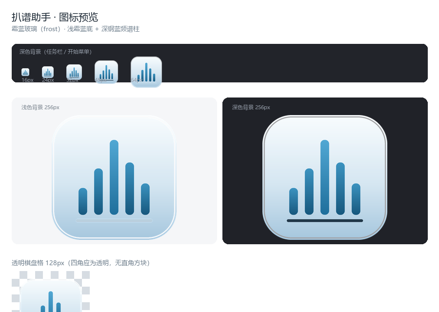

# 扒谱助手 · audio2score

> 把音频自动转成乐谱的桌面应用 —— 拖进去、选模式、点按钮，得到 **MuseScore 可直接打开编辑的 MIDI**。




---

## 这是什么

上游扒谱内核（[AutoTranscriber](https://github.com/GuyueHermit/AutoTranscriber)）本身已能扒谱，但**只有命令行入口**：要手敲十多个开关（`--n_peaks`、`--hop_length`、`--onset_threshold`、`--demucs_model` …），模式之间还有参数耦合（人声要 `n_peaks=2`、和弦要 5–8），普通用户根本用不起来；长任务又毫无进度反馈，不知道是不是卡死了。

**扒谱助手**把这些封进一个桌面应用：不碰命令行，三步出 MIDI。

- 拖入音频 → 选模式 → 点按钮
- 自动分离人声 / 伴奏，分别扒成独立音轨
- 输出标准 MIDI，轨名、乐器、速度都已处理好，MuseScore 4 打开即可继续编辑

---

## 功能

| 能力 | 说明 |
|---|---|
| **零命令操作** | 拖入音频 + 选模式 + 点按钮，三步得到 MIDI，全程不接触命令行 |
| **人声 / 伴奏分离** | 基于 Demucs（htdemucs）AI 音源分离，人声与伴奏分轨输出 |
| **六条扒谱路径** | 全自动双轨 · 只扒伴奏 · 只扒人声旋律 · 基本扒谱（单/多音轨）· 已分离音频直入 |
| **主流格式通吃** | mp3 / wav / flac / ogg / opus / aiff 原生支持；m4a / aac / wma 等经 ffmpeg 转码兜底，失败给明确中文原因而非堆栈 |
| **过程可见** | 分离 / 频谱分析 / 音符追踪 / 生成 MIDI 四阶段进度 + 百分比 + 实时日志 |
| **MuseScore 可用** | 导出的 `.mid` 轨名正确（人声 / 伴奏 / 乐器名）、program 合理、tempo 正确 |
| **多入口同源** | GUI / CLI / MCP 三种接法共用同一套引擎核心，行为完全一致 |
| **四套视觉** | 霜蓝玻璃 / 暗房琥珀 / 深海声谱 / 素纸墨青，运行时热切换 |

---

## 快速开始（普通用户）

1. 到 **[Releases](https://github.com/LinnnnYue/audio2score/releases)** 下载最新版安装包（形如 `audio2score_x.x.x_x64-setup.exe`）。
2. 安装并首次启动。应用会引导你**联网安装扒谱引擎**（引擎体积大，不随安装包分发）。
3. 选择安装档位（见下表），等待完成。
4. 拖入音频 → 选模式 → 点击开始 → 得到 `.mid`。

### 引擎安装档位

| 档位 | 内容 | 体积 | 耗时 | 适用 |
|---|---|---|---|---|
| `basic` | librosa / scipy / pretty_midi / soundfile / av | 约 200 MB | 1–2 分钟 | 基本扒谱（**不做人声伴奏分离**） |
| `full`（默认，推荐） | basic + torch(cu124) + demucs | 约 5.2 GB | 10–25 分钟 | 完整功能（分离人声 / 伴奏） |
| `mcp` | full + MCP SDK | 约 5.2 GB | +10 秒 | 额外提供 MCP 服务端 |

> 想先试水，装 `basic` 即可；确认要分离人声/伴奏再升级到 `full`。
> 下载走国内镜像择优（镜像与版本约束在安装前会校验），无需自备网络工具。

---

## 从源码构建

### 环境要求

- **Windows 10 / 11 x64**
- **Node.js 18+**
- **Rust**（stable 工具链，含 `cargo`）
- **Python 3.10 – 3.13**（3.14 尚无 torch wheel，勿用）

### 步骤

```bash
git clone https://github.com/LinnnnYue/audio2score.git
cd audio2score

# 1) 前端依赖
npm install
npm --prefix src install

# 2) 拉取随包分发的独立 CPython 运行时（约 50MB，不入库）
python engine/tools/fetch_runtime.py

# 3) 打包（⚠️ 必须在仓库根目录执行）
npm run tauri:build
```

产物位于 `src-tauri/target/release/bundle/`。

> **不要用 `cargo build`** —— 它跳过前端构建，打出的包会白屏。
> 交付一律走 `npm run tauri:build`。

### 可选：构建期注入诊断上报凭证

应用内置的故障诊断上报是**可选**能力。若你在自己构建时需要它，在构建前设置环境变量即可，源码中不含任何凭证：

```bash
# PowerShell
$env:BAPU_REPORT_TOKEN = "你的 PushPlus token"
npm run tauri:build
```

未注入时该功能静默降级，主流程完全不受影响。

### 上游内核

`third_party/AutoTranscriber` 是上游的**只读快照**，不随仓库分发，需自行放置：

```bash
git clone https://github.com/GuyueHermit/AutoTranscriber third_party/AutoTranscriber
```

本项目对上游**一字不改**，所有适配都在 `engine/` 层完成。

---

## 命令行（CLI）

不想开 GUI 时，可以直达引擎：

```bash
# 最简：输出同目录同名 .mid
python engine/cli.py 歌曲.mp3

# 指定模式与输出
python engine/cli.py 歌曲.mp3 -m vocals -o 旋律.mid

# 批量
python engine/cli.py *.mp3 -m accompaniment

# 已分离好的音频直入（跳过 Demucs）
python engine/cli.py 人声.wav -m pre_separated --extra 伴奏.wav

# 结构化输出（供脚本消费）
python engine/cli.py 歌曲.mp3 --json

# 查看能力（依赖是否装齐、GPU 是否可用）
python engine/cli.py --caps
```

**退出码即契约**：`0` 成功 · `1` 业务失败 · `2` 参数错误 · `3` 环境未就绪。

---

## MCP 服务

引擎可作为 MCP（Model Context Protocol）服务端接入支持 MCP 的客户端：

```bash
python engine/mcp_server.py
```

配置模板见 [`mcp/bapu.json`](mcp/bapu.json)（把其中的 `<REPO>` 替换为你的仓库绝对路径）。

---

## 项目结构

```
├─ src/                 Tauri 2 + React + TypeScript + Tailwind（前端）
│  ├─ 功能页 + 四方向主题层（CSS 变量驱动热切换）
│  └─ Tauri command / event 通道
├─ src-tauri/           Rust 壳：无边框窗口、文件对话框、目录揭示、sidecar 生命周期
├─ engine/              Python 引擎
│  ├─ bridge.py         适配层：参数映射 / 阶段进度上报 / 轨道编排 / 错误中文化
│  ├─ pipeline.py       六条产品路径的编排实现
│  ├─ bootstrap.py      首启引导安装（三档）
│  ├─ cli.py            命令行入口
│  └─ mcp_server.py     MCP 服务端
├─ mcp/                 MCP 配置模板
├─ docs/                设计文档与图标
└─ third_party/         上游 AutoTranscriber 只读快照（需自行放置，不入库）
```

---

## 技术栈

- **桌面壳**：Tauri 2（Rust）+ React + TypeScript + Tailwind CSS
- **引擎**：Python（librosa 路线；完整档加 PyTorch + Demucs）
- **通信**：stdin / stdout JSON 行协议（`engine/bridge.py`）
- **产物**：约 15 MB 的应用壳 + 首启按需安装的引擎

---

## 已知取舍与限制

- **引擎不随包分发**。完整档引擎实测约 5.1 GB（torch 一家占 4.4 GB），打进安装包不现实，故改为首次运行联网引导安装。
- **输出为 MIDI**。MuseScore 打开 `.mid` 会落在导入总谱视图，不如原生 `.musicxml` 的分谱表体验精细 —— 这是已知的取舍。
- **进度百分比为估算值**。上游无回调机制，进度由 stdout 逐行解析 + 阶段推断得到，非精确值。
- **人声音高检测**优先用 CREPE（深度学习，更准），不可用时降级到 pYIN，界面会提示当前所用算法。
- **仅 Windows x64** 提供预编译包。

---

## 许可与免责声明

**本软件仅供个人学习与研究使用，保留所有权利。**

- 请勿用于任何商业用途，请勿二次分发或再发布。
- 请勿用于抓取、复制、传播任何受版权保护的音乐作品。使用者须自行确保对所用音频拥有合法权利，由此产生的一切后果由使用者自负。
- 本软件按「现状」提供，不附带任何明示或暗示的担保。作者不对使用本软件造成的任何损失承担责任。
- 完整条款见 [LICENSE](LICENSE)。

---

## 致谢

- **[AutoTranscriber](https://github.com/GuyueHermit/AutoTranscriber)**（作者 GuyueHermit）—— 本项目的扒谱内核，人声分离、多音高估计与 MIDI 导出能力均来自上游。
- 以及 [librosa](https://librosa.org/)、[Demucs](https://github.com/facebookresearch/demucs)、[pretty_midi](https://github.com/craffel/pretty-midi)、[Tauri](https://tauri.app/) 等开源项目。

---

<p align="center">如果这个工具对你有帮助，欢迎通过 <a href="https://afdian.com/a/LinnYue">爱发电</a> 支持作者 ☕</p>
