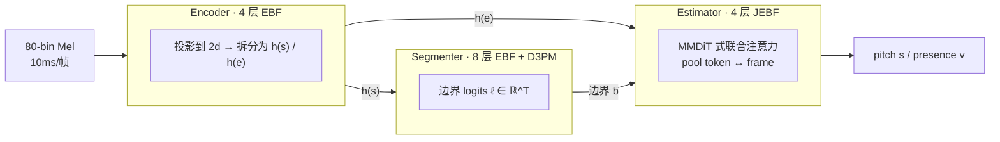

# GAME 与 Vocal2Midi 技术解析 · 与「扒谱助手」接入方案

> 调研日期：2026-10-07 · 状态：**仅解析，未执行任何改动**
> 来源：GitHub 仓库原文（含 `ALGORITHMS.md` 技术报告全文）、B 站视频简介、两视频评论区全量（102 + 130 条主楼含楼中楼）

---

## 0. 结论先行（TL;DR）

| 问题 | 答案 |
|---|---|
| 它用了什么算法？ | **D3PM 结构化离散扩散**（生成式）做**音符边界**检测，而非传统的单次判别式 |
| 它用了什么模型？ | GAME：三阶段 `Encoder(4层) → Segmenter(8层+D3PM) → Estimator(4层)`，EBF/JEBF backbone，small 12.7M / medium 49.9M / large 99.0M |
| 为什么这么准？ | ① 迭代去噪逐步精化边界；② 音高用 257-bin 软分类取加权质心（连续浮点值）；③ **大量噪声/混响数据增强**（脏数据吊锤同类）；④ 可把"已知词边界"作为条件注入 |
| 两个视频什么关系？ | **GAME 是引擎，Vocal2Midi 是集成商**。Vocal2Midi 直接调用 GAME（其模型路径写着 `GAME-1.0.3-medium-onnx`），外加 ASR 填词 + 强制对齐 |
| 集成成本 | **medium ONNX 仅 171 MB**（large 345 MB / small 44 MB），MIT 许可，可跑 DirectML/CPU |
| 最大限制 | 只做人声**单旋律**；不支持乐器/多声部/和声/纯音乐；**不输出 BPM**（须外部测速填入） |

---

## 1. 两个视频 / 两个项目的定位关系

```
        ┌─────────────────────────────────────────┐
        │  GAME  (openvpi)  —— 引擎层             │
        │  Generative Adaptive MIDI Extractor     │
        │  D3PM 离散扩散 · 音频 → 音符序列        │
        └───────────────▲─────────────────────────┘
                        │ 被调用（GAME-1.0.3-medium-onnx）
        ┌───────────────┴─────────────────────────┐
        │  Vocal2Midi  (Xiantaidu)  —— 集成层     │
        │  = GAME + ASR填词 + 强制对齐 + 量化     │
        │  音频 → MIDI / USTX / VSQX             │
        └─────────────────────────────────────────┘
```

| 项 | GAME | Vocal2Midi |
|---|---|---|
| 视频 | BV1K7AHzwEQU（2026-03-21） | BV1Ww7C6kEqL（2026-06-05） |
| UP | YQ之神 | 闲_态度 |
| 仓库 | `openvpi/GAME` | `Xiantaidu/Vocal2Midi` |
| 许可 | MIT | Apache-2.0（**模型另有协议**） |
| star | 282 | 134 |
| 形态 | PyTorch 训练/推理仓库 + ONNX 发布物 | Windows 桌面整合包（4GB+） |
| 语言 | Python (PyTorch 2.8 / CUDA 12.9 / Lightning 2.6.1) | Python + ONNX Runtime (DirectML/CPU) + PySide6 |
| 最近推送 | 2026-08-29 | 2026-10-06 |

> 视频简介原文佐证：Vocal2Midi 简介致谢 `@YQ之神 @夜燐Yarin @秋之枯草`；GAME 简介致谢「程序开发：小狼@夜燐Yarin」。

---

## 2. GAME 深度解析（核心）

### 2.1 定位

- 全称 **Generative Adaptive MIDI Extractor**，前身是 `openvpi/SOME`（Singing-Oriented MIDI Extractor，706 star）。
- 任务：**AST（Automatic Singing voice Transcription）**——单旋律歌声音频 → 带精确 onset/offset 边界 + 连续音高值的音符序列。
- 官方原文对比对象：前身 SOME、以及 **ROSVOT**（arXiv 2405.09940）。
- 核心卖点原文：*"use of **structured discrete diffusion (D3PM)** for boundary detection, replacing the conventional single-pass discriminative approach with an iterative generative process."*

### 2.2 输入输出规格

| 项 | 值 |
|---|---|
| 采样率 | 44100 Hz |
| 帧长 | hop 441 samples = **10 ms/帧** |
| FFT | 2048 |
| mel | **80 bins**，覆盖 0–8000 Hz |
| 输出 1 | `boundaries b ∈ {0,1}^T` 帧级边界 |
| 输出 2 | `regions r`（由边界累加得到，把帧映射到区域号） |
| 输出 3 | `pitch s ∈ [0,128]` **连续浮点 MIDI 音高** |
| 输出 4 | `presence v ∈ {0,1}^N` 有声/无声（**无独立预测头**，由音高 bin 激活导出） |

注意：**时长不是显式输出**——由相邻边界隐含决定。

### 2.3 三阶段架构



- **EBF backbone**（Encoder + Segmenter 共用）：残差 + pre-RMSNorm + LayerScale（初始 1e-6）。
  核心块 **PAC = Parallel Attention + Convolution**：自注意力（带 RoPE）与 **CgMLP**（深度可分离卷积 + GLU，k=31 帧 = 310 ms）并行，再经深度卷积合并。
- **JEBF backbone**（Estimator）：MMDiT 式**联合注意力**，把每个音符区域的 **pool token** 与帧级特征相连。
- **混合 RoPE**：一半编码全局绝对位置，一半编码区域相对位置（pool token 该半位置恒为 0）。

### 2.4 D3PM 扩散细节（最核心的"为什么准"）

**状态空间**：每帧二值（是否边界）。

**前向（加噪）**：**吸收式扩散**——边界只能被移除（1→0），永不凭空产生。
噪声调度为**余弦**：`p(t) = (1 + cos(tπ)) / 2`，`t=0` 全噪、`t=1` 干净（与常规扩散记号相反）。

**反向（去噪）**：采用 **x₀-prediction**——模型直接预测干净边界序列，而不是预测单步逆转移。

**推理算法（K 步迭代）**：
```
b ← b_known                      # 可注入已知边界
for i in 0..K-1:
    t ← i/K ; p ← (1+cos(tπ))/2
    b ← removeMutable(b, b_known, p)   # 把上一轮预测的边界随机"重新加噪"
    r ← cumsum(b) + 1
    ℓ ← Segmenter(h(s), r, t, languageId)
    b ← softBoundaryDecode(σ(ℓ), barriers=b_known, τ=0.2, r=2)
```

关键机制：
1. **再噪声自洽**：每步把上一轮预测的边界随机移除一部分，让模型重新预测 → 形成自一致性正则。
2. **早期步做粗结构、后期步做细调**。
3. **已知边界可注入且不可变**（`mutable-aware removal`，移除概率按 `min(1, n·p/m)` 缩放）→ 这就是**"歌词灌注/词边界对齐"的技术底座**：给定词边界，模型只在词内填空出音符级 onset。
4. **边界解码**：sigmoid → 半径 2 帧的局部极大 → 阈值 τ=0.2 过滤。

**质量-速度可调**：`K ∈ {1,2,4,8,16}`。官方结论：**K=4–8 最实用，K=1–2 快 4–8 倍**。

### 2.5 音高估计（Estimator）

- pool token → 线性层 → **257 bins**（均匀覆盖 MIDI [0,128]）。
- 解码：sigmoid → argmax → 窗口 `w = ⌈3σp/Δk⌉` → **加权质心** → 连续浮点音高。
- 存在性：`presence = max_k probs[k] ≥ τv = 0.2`。
- **用 BCE 做"软回归"**：σp = 0.5 半音，相邻 bin 大幅重叠 → 比交叉熵/直接回归校准更好。
- 官方理由：输出浮点音高「suitable for DiffSinger variance labeling」。

### 2.6 三个损失

| 损失 | 形式 | 作用 |
|---|---|---|
| `L_region` | **对比损失**（区域内部拉近 cosSim→1；邻域 w=5 内不同区域按 `-exp(1-|Δr|)` 推远，上三角 mask 防重复计数） | 让 Segmenter 隐层在音符内一致、音符间可分 |
| `L_boundary` | BCEWithLogits(ℓ, **高斯软化边界**) σb=1.0（≈±30 ms） | 承认边界定位本身有感知模糊 |
| `L_note` | BCEWithLogits(ℓ_note, **高斯糊 bin**) σp=0.5 半音 | 软分类回归音高 |

总损失 = 三者简单相加。

### 2.7 抗噪的来源 = 数据增强（**这是"脏数据吊锤"的根本原因**）

| 增强 | 概率 | 参数 |
|---|---|---|
| 有色噪声 | 0.25 | PSD ∝ (1/f)^β，β~U(0,2) |
| **自然噪声** | 0.25 | 最多 3 段环境/音乐录音，独立 ±1 八度变速 + 增益，**SNR 6–24 dB** 混入 |
| **RIR 混响** | 0.25 | 房间冲激响应卷积（推荐 MB-RIRs） |
| 移调 | 0.5 | ±12 半音（改 STFT 参数而非重采样） |
| 响度 | 0.5 | ±6 dB |
| 频谱掩蔽 | 0.15+0.15 | 时间掩蔽 ≤50 帧、频率掩蔽 ≤20 bins，可相交 |

训练数据：**约 32 小时人工标注的私有歌声数据**（英/日/粤/中四语），验证集 100 条留出录音。
增强用公开集：DEMAND / MUSAN / MIR-1K / MusicNet / MUSDB18-HQ / MB-RIRs。

### 2.8 模型规格与官方指标

| | small | medium | large |
|---|---|---|---|
| 参数量 | 12.7 M | **49.9 M** | 99.0 M |
| emb dim / heads | 128 / 4 | 256 / 8 | 256 / 8 |
| enc / seg / est 层数 | 4 / 8 / 4 | 4 / 8 / 4 | 8 / 16 / 8 |
| ONNX 体积 | **43.6 MB** | **171.4 MB** | **344.9 MB** |

**干净集最优**：medium @ K=8 → QER 0.1230、Presence F1 **0.9923**、Raw Pitch Accuracy **0.9486**、Overall Accuracy **0.9503**、Pitch RMSE 0.552 半音
**脏集最优**：medium @ K=4 → QER 0.1334、Overall Accuracy 0.9442

> 官方结论：**medium 是性价比最优**（视频样例与 Vocal2Midi 默认都用 medium）。large 在干净集上反而**过拟合扩散精化过程**（K 越大越差）。

---

## 3. Vocal2Midi 深度解析（集成层）

### 3.1 完整管线（官方原文）

```
audio
  -> optional RMVPE pitch curve          # 可选音高曲线
  -> slicing                             # 切分（默认 5–10 s）
  -> ASR: Qwen3-ASR / PinyinASR / RomajiASR
  -> lyric matching / .lab generation    # 歌词匹配
  -> forced alignment: TiFA 或 HubertFA  # 强制对齐
  -> GAME note extraction                # ★ 核心：GAME 提音符
  -> quantization: 智能节奏对齐 / 简单量化
  -> export: MIDI / USTX / VSQX / TextGrid / WAV
```

无歌词路径：`audio → RMVPE → slicing → GAME pitch-only extraction → export`

### 3.2 组件清单与运行时栈

| 组件 | 角色 | 后端 | 集成方式 |
|---|---|---|---|
| **GAME** | 音符与音高提取 | ONNX Runtime | 直接调用（`GAME-1.0.3-medium-onnx`） |
| **TiFA** | 默认强制对齐（中/日/英/粤） | ONNX | vendored `inference/TiFA/` |
| HubertFA | 音素级强制对齐 | ONNX | vendored（**不支持粤语**） |
| Qwen3-ASR | 主 ASR（1.7B） | ONNX + **llama.cpp**(CPU 解码) | `inference/qwen3asr_dml/` |
| PinyinASR | 中文轻量 ASR | ONNX | `Xiantaidu/PinyinASR` |
| RomajiASR | 日语 mora ASR | ONNX | `Xiantaidu/RomajiASR` |
| kashi-g2p | 日语 G2P（lattice beam search） | ONNX | `Xiantaidu/kashi-g2p` |
| pyopenjtalk | 备选日语 G2P | 原生 | — |
| **RMVPE** | **音高曲线提取** | ONNX | `inference/API/rmvpe_api.py` |
| LyricFA | 歌词匹配 / G2P 对齐辅助 | — | vendored |
| FunASR | Qwen3-ASR 路径的 ASR 基础 | — | 引用 |

设备：**DirectML 默认，CPU 回退**（legacy `cuda` 归一化为 `dml`）。

### 3.3 导出格式

`.mid` / `.ustx`（OpenUTAU 工程，**比 MIDI 多了音高线**）/ `.vsqx` / `.txt` / `.csv` / `TextGrid` / 切块 `.wav` / `.lab`

---

## 4. 配套组件要点

### 4.1 TiFA（Token-Imputing Forced Aligner）
- 官方卖点：**发音评分**（在候选发音中挑最匹配音频的）、**语义与音素双重对齐**、抗标注错误/噪声/混响/伴奏、多语言混排、**无参考标注也能自诊断对齐质量**。
- G2P 用 `openvpi/g2pflow`，默认含中文（普通话 + 粤语）、日语、英语转换器。
- 与 GAME 的接口：TiFA 给出**词边界**，GAME 把它作为 `b_known`/`barriers` 注入，只在词内补音符级 onset。

### 4.2 RMVPE（音高曲线）
- 官方明确：**「GAME 本身不具备音高曲线提取功能，在 OpenUTAU 中需使用 RMVPE 算法提取音高曲线」**。
- 即：GAME 给"音符 + 音符音高"，RMVPE 给"逐帧连续 F0 曲线"（用于翻调还原颤音等）。

---

## 5. 评论区实战情报（金矿）

### 5.1 GAME 侧（UP「YQ之神」亲答）

| 问题 | 官方回答 |
|---|---|
| 导出 MIDI 是固定 120 BPM 吗？ | **不是**，但 GAME 不测速 ——「你可以用其他工具测速以后填入」 |
| 支持和声/多声部吗？ | 「和声不属于我们主动增强的方向，**意外地能抗一点点**」；多声部**不支持** |
| 支持乐器（长笛/钢琴）吗？ | **不支持**——「歌声 MIDI 提取是我们研发歌声合成的**副产物**」 |
| 支持纯音乐吗？ | 不能 |
| 音高曲线？ | 「在 OpenUTAU 编辑器里**配合 RMVPE** 提取器使用可以得到音高曲线」 |
| 去混响后效果更好吗？ | 「如果你的去混响模型对人声的**损伤比较小**，效果应该比带着混响好」 |
| vs Synthesizer V？ | 「**干净数据小胜，脏数据吊锤**，但是现在没有歌词识别」 |
| vs soulx singer（带歌词）？ | 「那个是**多种算法组合**才有的歌词，这个单纯是 MIDI 提取算法，但**设计上可以对接歌词识别**，等后续其他人实现前面部分」 |
| 显卡支持？ | ONNX + **DirectML，Windows 上理论支持 N / A / I 三家**；4060 够用，950 也能跑；**别选核显** |
| 超长音频报错？ | 打开 `config/GameInfer.ini` 把 `max_audio_seg_length` 改长，**太长会爆显存** |
| 语言要选对吗？ | 「提取音符本身**不强依赖语言**，选择通用即可」（但影响切分效果） |
| 批量处理？ | 「原始的 PyTorch 仓库**支持批量推理**」 |
| 大 Delay？ | 「能扛住一部分，但肯定会影响效果」 |

**旁支发现**：社区已有 macOS 的 Rust/MLX 移植 `Da1sypetals/game-mlx-rs`。

### 5.2 Vocal2Midi 侧（UP「闲_态度」亲答）

| 问题 | 官方回答 |
|---|---|
| 与 GAME 什么关系？ | 「是包含 GAME 在内的**一条 pipeline 的整合**，本身用了 GAME，效果上也受其他开源组件制约，但**总体相差不大**」 |
| 体积为什么 4GB+？ | 「内含**完整的运行环境和 Qwen3-ASR**，做不小了」 |
| 配置要求？ | 「不在意速度的话，**纯 CPU + 16GB 内存**大概就能跑，速度约 1 倍速」 |
| 要先分离人声吗？ | **「需要，人声的质量对转写后 MIDI 的质量有较大影响」** |
| BPM 怎么填？ | 「根据原曲 BPM 填，不知道可用 BPM Analyzer 检测，或**保持默认 120**」；运行前**建议准确填好** |
| 显存不足会怎样？ | **歌词全变 "la"**（切 CPU 可恢复） |
| 支持乐器/纯音乐？ | 「乐器不支持」「纯音乐提取不出来，模型是为人声设计训练的」 |
| 支持哼唱？ | 「哼唱也可以，**建议把输出歌词关掉**效果可能更好」 |
| 韩语？ | 「可以转 MIDI，暂不支持转写歌词」 |
| 商用？ | 「软件商用需遵守 Apache 2.0 协议，**需要注意使用的模型另有其自身协议**」 |
| 版权？ | 「MIDI 本身不产生新版权，版权仍属于原歌曲著作权人」 |
| ustx 给谁用？ | 「给 OpenUTAU 用，主要就是比 MIDI 多了抽的音高线」；给 XStudio 需 UtaFormatix 转换 |

### 5.3 ★ 最有价值的一条：GAME vs SheetSage2 实测对比

用户 `CaoTurkey` 做的横向对比（GAME 1.0.3 **large** ONNX vs `m-a-p/SheetSage2` bf16，RTX 4060 Laptop 8G，Fedora 44）：

| 维度 | GAME | SheetSage2 |
|---|---|---|
| **时间对齐** | 边界**直接解在音频时间上，全程贴合** | 靠时间戳 token 插值回秒，**BPM 预测抖动**，中后段最大 **~90 ms 漂移** |
| **音准** | **声学实测音高**，与真实音区一致 | 输出**谱面记谱八度**（两首歌差值众数恰好 +12，训练语料是乐谱） |
| **节奏** | 默认参数下有**杂拍、一音切两段、连奏处两音连一段** | 解码受语法约束：音高整数半音、时长量化到栅格（下限 32 分）→ **音符很纯很标准** |
| 纯人声 | **不剥伴奏时伴奏干扰明显重于 S2** | S2 训练含此类任务，抗干扰更好 |
| 乐理 | 移调归一后双方仅 **~51% 音级完全一致**（分歧在三度/七度） | 人工听感「更像谱子」 |
| 速度 | 220 s 曲 → **9.3 s** | 220 s 曲 → **7.5 s** |

**结论**：**GAME 强在"时间对齐贴合音频"，SheetSage2 强在"谱面纯净规范"**。这条情报直接指出了**"准确"有两种含义**——声学贴合 vs 记谱规范，我们选型时必须先明确要哪一种。

> 备注：SheetSage2 属于 `m-a-p`（Music AI Partnership）的乐谱生成模型，与本项目**无任何代码关系**，仅作横向参照。

---

## 6. 「为什么这么准」的归因（逐条对应）

| 机制 | 带来的精度 |
|---|---|
| D3PM 迭代去噪 | 边界不再是"一次猜"，而是 K 步自洽精化 → QER 比单次判别低 |
| 对比损失 `L_region` | 音符内特征一致、邻域可分离 → 边界定位更锐 |
| 高斯软化标签（σb=1.0 / σp=0.5） | 承认感知模糊，避免过拟合到单帧/单 bin |
| 257-bin 软分类 + 加权质心 | 得到**连续浮点音高**，不受整数半音限制 → RPA 94.9% |
| 无独立 presence 头 | 存在性由音高激活导出，避免两个头互相打架 → Presence F1 **0.9923** |
| **自然噪声 + RIR 混响增强** | 直接对应"脏数据吊锤"——这是**抗伴奏残留/环境噪/混响**的根本 |
| **已知边界可注入 + barriers 解码** | 词边界对齐不破坏，只在词内填空 → 歌词灌注的前提 |
| 语言条件（50% dropout 训练） | 不同语言的切分习惯被显式建模，同时保留通用性 |

---

## 7. 对「扒谱助手」的接入方案

### 7.1 现状差距

| 维度 | 现项目 `audio2score` | GAME 路线 |
|---|---|---|
| 架构 | Tauri 2 + Python 引擎（上游 AutoTranscriber，Basic Pitch 系） | 纯推理，ONNX |
| 对象 | **混音** → 靠 Demucs 分离 → 各轨转写 | **人声特化** 单旋律 |
| 引擎体积 | full 档 ~5.2 GB（torch CUDA + Demucs） | **medium ONNX 171 MB**（含运行时也远小于此） |
| 范式 | 单次判别（帧级 pitch 估计 + 后处理） | **生成式**（扩散迭代边界） |
| 歌词 | 无 | 有（+ASR+对齐） |

### 7.2 四个可选方案

| 方案 | 内容 | 收益 | 代价 / 风险 |
|---|---|---|---|
| **A. 只接 GAME 做人声轨引擎**（推荐起点） | Demucs 分出的 vocal 轨 → GAME(medium ONNX) → 音符；伴奏轨维持现状 | 人声轨精度跃升；**+171 MB**；MIT 可商用 | 需新增 ONNX Runtime 依赖；GAME 不吐 BPM；和声/多声部仍不支持 |
| **B. A + RMVPE** | 再挂 RMVPE 提音高曲线，导出含 pitch bend 的 MIDI | 更接近原唱表现（翻调场景） | 再 +1 个模型；曲线与音符要对齐 |
| **C. 全链路（对齐 Vocal2Midi）** | + ASR(Qwen3-ASR 1.7B) + TiFA 对齐 → 带歌词 MIDI/USTX | 一步出"带词 MIDI"，直击翻调用户 | **体积暴涨（Qwen3-ASR 是 4GB 整合包的主因）**；模型许可需逐个核查 |
| **D. 零集成** | 文档里推荐用户自己用 GAME/OpenUTAU | 零成本零风险 | 体验割裂，不解决"我们自己的准不准" |

### 7.3 推荐路线

**分两步走，先 A 后 C 的可选组件：**

1. **第一步（A）**：把 GAME 作为**可选引擎**接入，包在 `engine/` 层（**绝不动 `third_party/`**）。
   - 模型走**首启按需下载**（与现有"引擎不随包分发"策略一致），medium 档 171 MB 用户可接受。
   - 与现有链路并存：人声轨走 GAME，伴奏/其他轨维持现状 → 失败可降级，符合"不允许无出路的终态"。
2. **第二步（B/C 按需）**：先补 RMVPE（体积小、收益直接），歌词/ASR 留作后续独立档位（可参考现有 `basic/full/mcp` 三档，新增 `vocal` 档）。

### 7.4 必须在实施前验证的问题（未验证假设清单）

> 以下均为**尚未实测**，不得在其上直接叠加实现（遵循本项目「未验证假设」约定）：

1. **GAME 在中文歌声 + 中文歌词场景的实际精度**——官方指标是私有数据集（4 语混），中文单语未见分项数据。
2. **BPM/拍号**：GAME 不输出，需要我们在 `midi_post.py` 侧补测速（或让用户填），这是与现有链路的接口缺口。
3. **ONNX Runtime + DirectML 在本机（Windows + 目标用户机）的兼容性**，以及纯 CPU 下的推理耗时。
4. **171 MB medium 在 4 GB 显存的用户机上的峰值内存**（官方只说 large 更长会爆；medium 未给显存数字）。
5. **"已知边界注入"能否用于我们的场景**（我们暂无歌词，但未来若加歌词需验证 TiFA→GAME 的接口）。
6. **许可证合规**：GAME 本体 MIT ✅；但若走 C 路线，Qwen3-ASR、HubertFA 等模型**各自协议需逐个核查**。
7. **是否真的优于现有链路**——必须在同一批曲子上做 A/B（按本项目铁律，**音乐真值验收权归老公**）。

### 7.5 反面提醒（来自评论区的坑）

- 用户反馈 GAME **默认参数下存在"杂拍、一音切两段、连奏两音连一段"** → 需要后处理量化（Vocal2Midi 专门做了"智能节奏对齐"引擎）。
- **伴奏残留干扰明显** → 前置分离质量直接决定成败（我们已有 Demucs，是优势）。
- 分卷压缩包 / Windows 自带解压不支持 → 分发体验坑（我们不适用，但有参考价值）。

---

## 8. 附录：来源与判据

| 材料 | 取得方式 | 一手性 |
|---|---|---|
| GAME `README.md` / `ALGORITHMS.md`(46 KB) / `ONNX.md` | `gh api repos/openvpi/GAME/readme` 等 | **一手原文** |
| Vocal2Midi `README.md` / `ACKNOWLEDGEMENTS.md` / `NOTICE` | `gh api repos/Xiantaidu/Vocal2Midi/...` | **一手原文** |
| SOME / TIFA README | `gh api` | 一手原文 |
| 两视频简介、标签、统计 | `api.bilibili.com/x/web-interface/view` | 一手 |
| 两视频评论（102 / 130 条主楼 + 楼中楼） | `api.bilibili.com/x/v2/reply/wbi/main`（wbi 签名翻页） | 一手 |
| 发布物体积 | `gh api repos/.../releases` | 一手 |
| 视频画面 | 封面已查（仅标题卡）；视频为**无讲解演示**，未逐帧分析 | 未采集 |

> 注：B 站视频**无弹幕（0 条）、无 UP 逐帧讲解**，信息量集中在简介与评论区，已全部采集。

---

*本文件由调研任务生成，仅作解析与方案参考，未对项目代码/产物做任何改动。*
